<!-- 29October2018 -->


<!-- output: powerpoint_presentation -->
<!-- ```{r setup, include=FALSE} -->
<!-- knitr::opts_chunk$set(echo = FALSE) -->
<!-- ``` -->

# Overview:

1. Crisis (Baker, big picture, computational focus)
2. Opportunities (data and code synthesis)
3. Tools for improving benefaction not just reproducibility
- From wet to dry to digitial (notes and digitizing records)
- Version Control for data and code (RStudio)
- Environment and dependencies
- Testing and checks (testthat, testdata)
- Data provenance (RDT, provR, recordR)
- Tools for linking Databases (figshare, dryad, pangea, Dataverse)
- Capsules (Code Ocean, ReproZip, encapsulator)
- Literate programming (Rmarkdown, Jupyter, OverLeaf, RStudio)
- Leaks in the Pipeline: Not recorded, not deterministic


# 

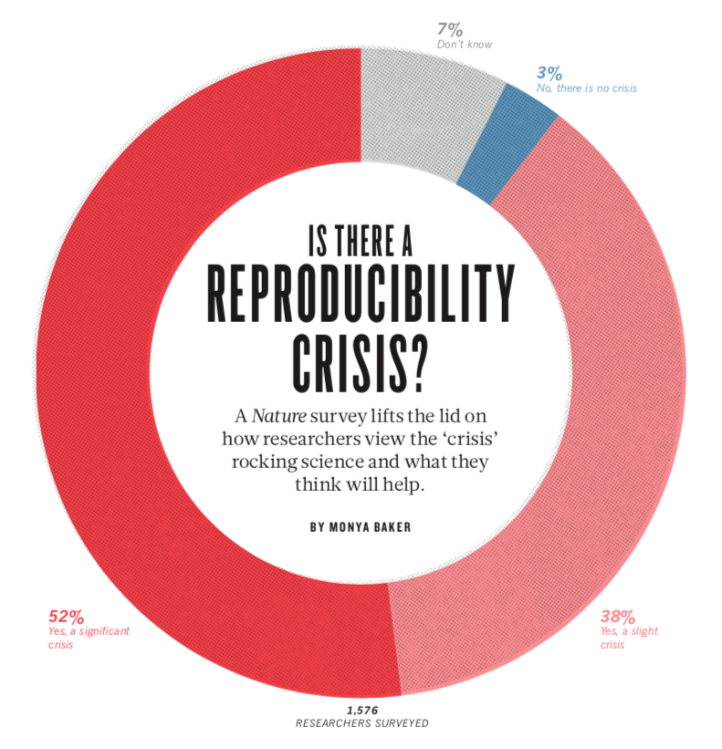

#

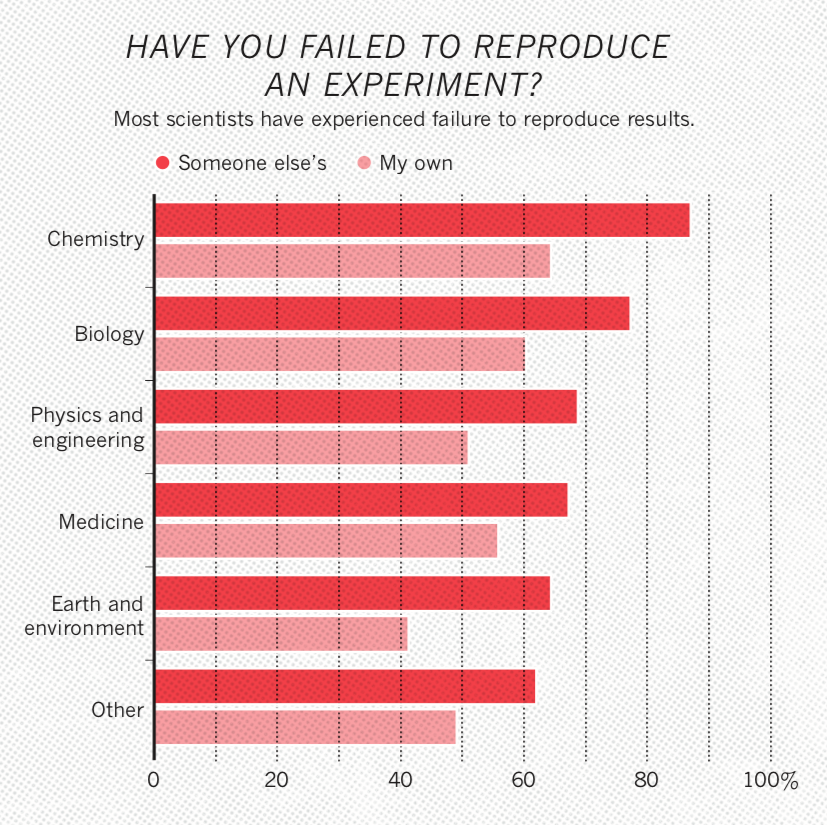

#

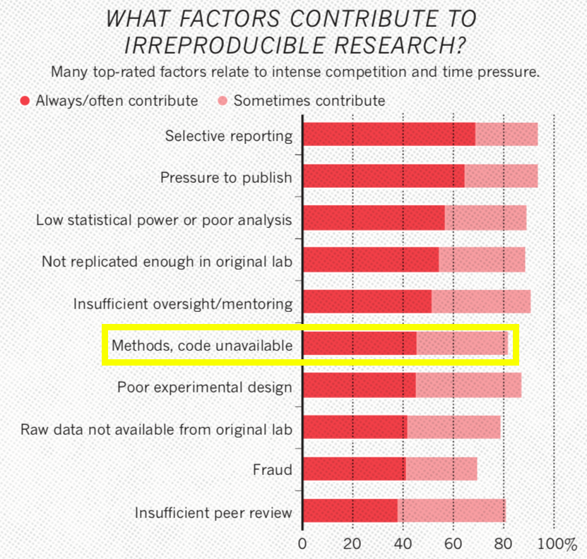

#

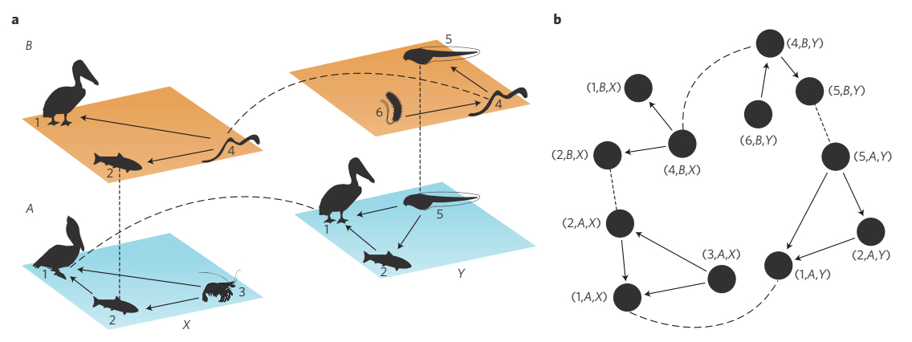

<!-- I'm an ecologist -->


# Motivation: Code in Ecology

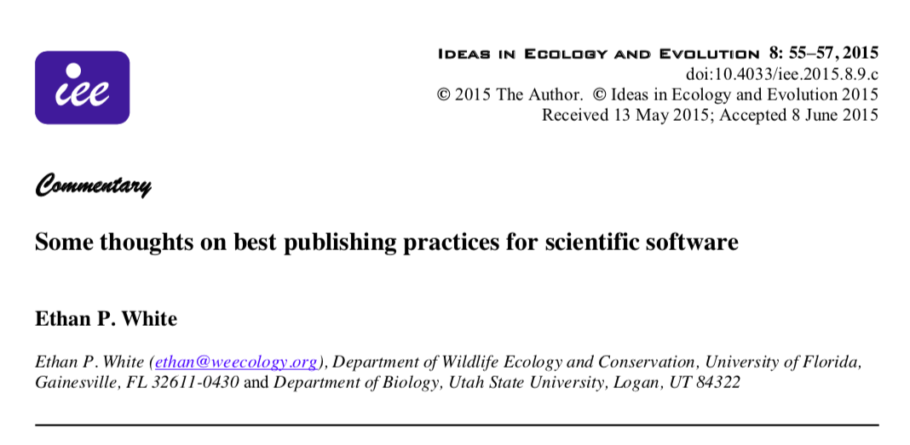{width=70%}

# Motivation: Ecology Journal Policies

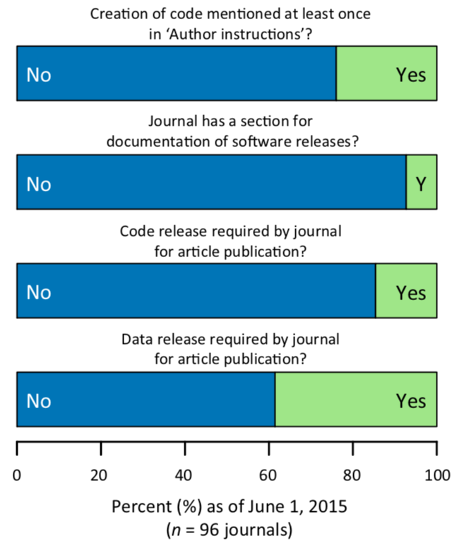{width=50%}

*Meeslan, Heer and White 2016 Trends in Eco Evo*

# Motivation: Social Science Journal Policies

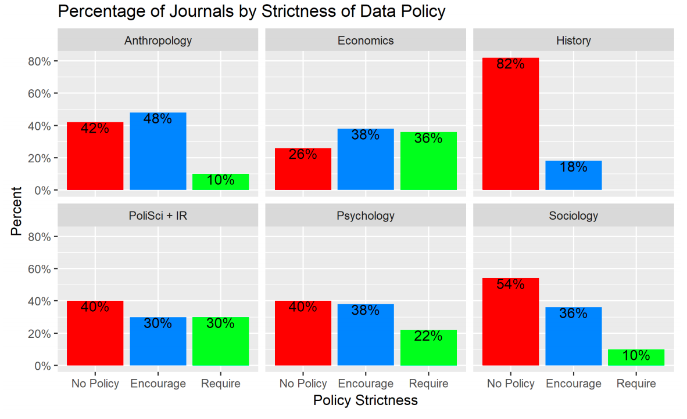{width=70%}

*Crosas et al. 2018 SocArXiv*

# Motivation: Journal Policy Impacts

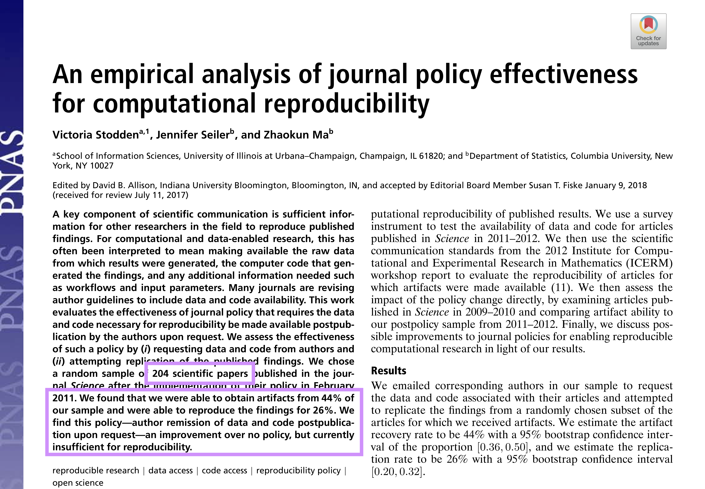{width=70%}


# Motivation: Journal Policy Impacts

{width=70%}

# Motivation: Journal Policy Impacts

{width=70%}

*Stodden et al. 2018 PNAS*

# Goal: Repeatability/Reproducibility

metadata + data + code + results + contact

# Goal: Repeatability/Reproducibility

BestPractices(metadata + data + code + results + contact)

# Goal: Repeatability/Reproducibility

BestPractices(metadata * data * code * results * contact)

# Opportunity: Benefaction not just reproducibility

$$ Synthesis = f(benefaction) $$

# Opportunity: Benefaction not just reproducibility

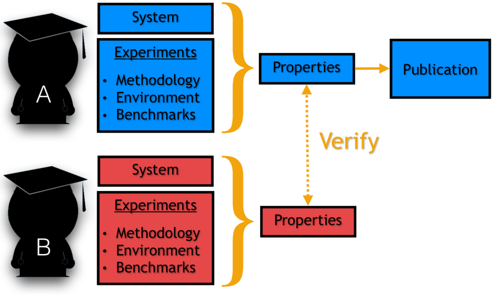{width=70%}

*Colberg et al. 2015 Comm ACM*

# Opportunity: Benefaction not just reproducibility

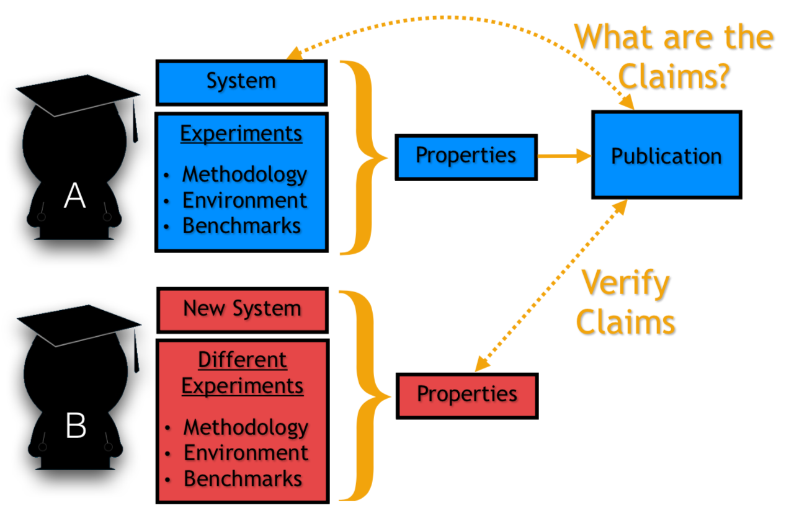{width=70%}

*Colberg et al. 2015 Comm ACM*

# Opportunity: Benefaction not just reproducibility

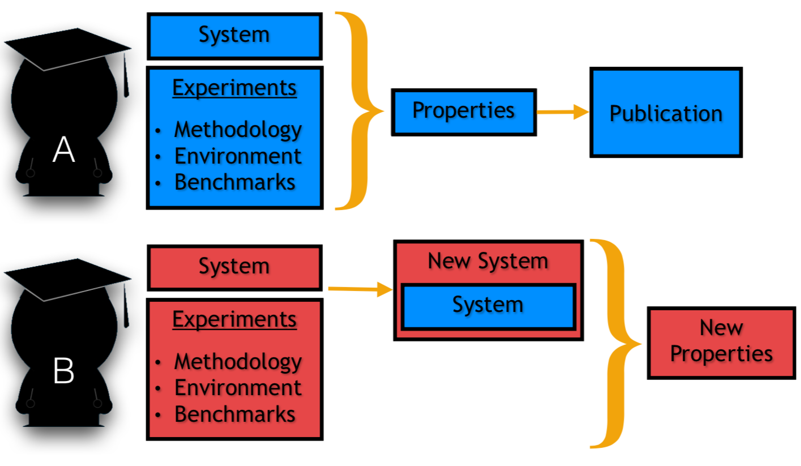{width=70%}

*Colberg et al. 2015 Comm ACM*


# Tools: Research Pipeline

| Thought      | Data Collection            | Data Processing               | Analysis                          | Reporting                  |
| :---------   | :------------------------- | :---------------------------- | :-------------------------------- | :------------------------- |
| *Meta-Data*  | *Meta-Data* + *Provenance* | *Provenance* + *Versioning*   | *Versioning* + *Provenance*       | *Lit Prog* + *Versioning*  |


# Reality: Common Ground

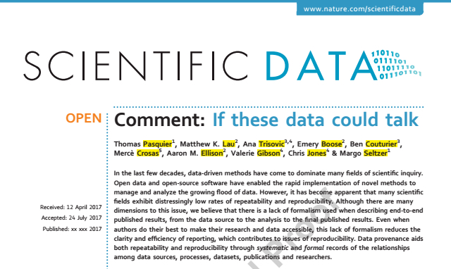{width=70%}

# Reality: Common Ground

{width=70%}

<!-- Similar challenges in Ecosystem Ecology and Particle Physics -->

# Reality: Common Ground

- *Most scientists don't want to produce software, they want to do
science.*


# Reality: Common Ground

- *Most scientists don't want to produce software, they want to do
science.*

- *Let's automate as much of the process as we can to lower activation
energy, decrease error rates and increase sharing.*


# Tools: Encapsulator


# Tools: Encapsulator

Goal: Simplify computational reproducibility

1. Create a data "capsule" with code, data and environment

# Tools: Encapsulator

Goal: Simplify computational reproducibility

1. Create a data "capsule" with code, data and environment
2. Increase transparency with "cleaned" code and workspace


# Tools: Encapsulator

Goal: Simplify computational reproducibility

1. Capsule = all necessary software and data
2. Cleaned = organize files, remove non-essential code and re-format

# Tools: Encapsulator

Basic Usage (current paradigm):

1. Code as usual in your normal environment while recording provenance
2. Run encapsulator from the console
3. List desired results
4. Product = Capsule containing essential code and data with a virtual machine

# What is data provenance?

{width=80%}


# Tools: Encapsulator

Example: Messycode

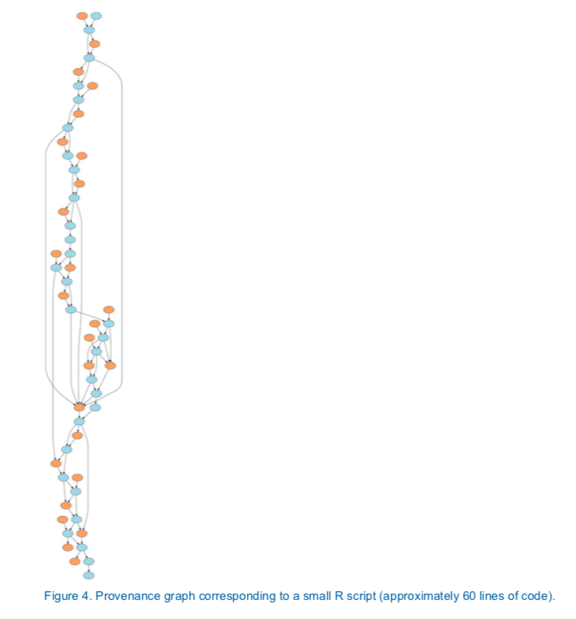{width=70%}

# Tools: Encapsulator

Example: Messycode

- near stream-of-consciousness coding that follows a train of thought in script development,
- output to console that is not written to disk,
- intermediate objects that are abandoned,
- library and new data calls throughout the script,
- output written to disk but not used in final documents,
- code that is not modularized,
- code that is syntactically correct but not particularly comprehensible.

# Tools: Encapsulator

Example: Messycode

{width=70%}

# Tools: Encapsulator

Example: Messycode

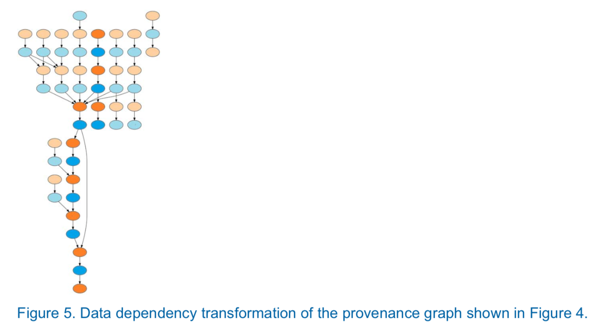{width=70%}

# Tools: Encapsulator

Requirements: Simplify computational reproducibility

1. The environment should present a user interface familiar to
   scientists.
2. Encapsulation and use (de-encapsulation) of time capsules must
require minimal technical expertise.
3. The installation process itself must also require minimum
intervention and technical knowledge.
4. Time capsules, their installation, and re-execution must be
   platform-independent.


# encapsulator(A Kit of Parts): Capsule creation

- Virtual Machine (encapsulator)
- Docker (containR)
- Literate computing notebook (Jupyter)
- Compressed (Reprozip)
- Capsule database (Code Ocean)


# What is data provenance?

{width=80%}


# What is data provenance?

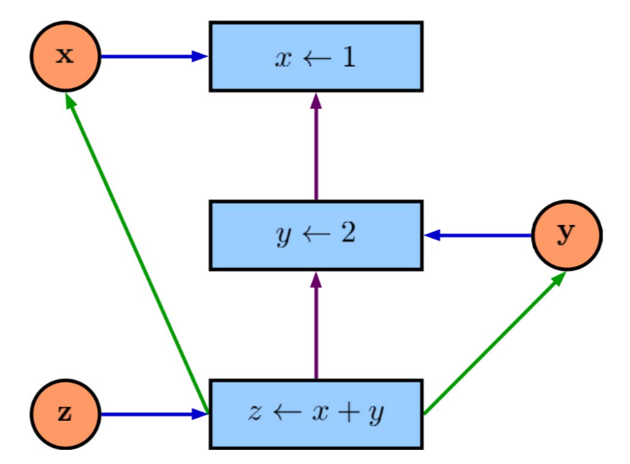{width=50%}

# Data Provenance and R


<!-- However, after almost ten years of being an open-source advocate... -->
<!-- Ecologists aren't CS majors, they're tree climbing, scub-diving types -->

# Data Provenance and R


<!-- Single-minded software, get the analysis done! -->

# Data Provenance and R

{width=70%}

# encapsulator(A Kit of Parts): Provenance Details

- inputs
- outputs
- transient data objects and their values
- operations
- library dependencies


# Encapsulator and benefaction

1. Eases and (potentially) improves project archiving
2. Increases clarity for re-use (others and self)

# Conclusion: The next great challenge is synthesis

<!-- Benefaction not irreproducibility! -->

** Software should not limit science **

# Conclusion: The next great challenge is synthesis

{width=20%}


# Questions and Discussion:

*Possible discussion topics:*

{width=20%}

1. What checks are in place to verify and link dataverses?
2. Can provenance production become a part of the checking system?
3. What are the pros and cons of automated checking/verification
   and/or cleaning/encapsulation of dataverses?
4. I'm focused on R's wild-wild-west, but how does this translate to
   other languages?

*Contact Info:*

**Email: _matthewklau@fas.harvard.edu_**

**Github: MKLau**

**Slack: MKLau**

*Much of this work was supported by NSF SSI-1450277 (End-to-End Provenance) and ACI-1448123 (Citation++).*
*More details are available at https://projects.iq.harvard.edu/provenance-at-harvard*

{width=19%}
{width=20%}
{width=25%}
{width=15%}


# Tools: Overview

|                 | Dataverse  | Code Ocean  |  Zenodo   | Figshare  | Dryad    | PANGAEA | GitHub & Bitbucket | Supplementary Material |
| :-------------- | :----:     | :----:      | :----:    | :-------: | :---:    | :-----: | :----------------: | :--------------------: |
| Meta Data       | Yes        | Yes         |  Yes      | Yes       | Yes      | Yes     | Yes                | Yes                    |
| Data Hosting    | Yes        | Yes         |  Yes      | Yes       | Yes      | Yes     | Yes                | Yes                    |
| Code Hosting    | Yes        | Yes         |  Yes      | No        | No       | No      | Yes                | Yes                    |
| Versioning      | No?        | No?         |  Yes      | No        | No       | No      | Yes                | No                     |
| Capsules        | No         | Yes         |  No       | No        | No       | No      | No                 | No                     |
| Assigns DOI     | Yes        | Yes         |  Yes      | Yes       | Yes      | Yes     | No                 | No                     |
| License         | Flexible   | Flexible    | Flexible  | MIT       | CC0      | CC-BY   | Flexible           | None                   |
| Cost            | None       | Possible    |  None     | None      | Possible | None    | None               | None                   |

*Adapted from Mislan, Heer & White 2016 Trends in Ecol Evol*


<!-- # encapsulator(A Kit of Parts): Checking inputs and outputs -->

<!-- - *lintR* (Hester 2017) -->
<!-- - *containR* (Chen 2018) -->

<!-- # encapsulator(A Kit of Parts): Code Formatting -->

<!-- - *formatR* (Xie 2017)  -->
<!-- - *styler* (Muller & Walther 2018) -->

<!-- # encapsulator(A Kit of Parts): Code Cleaning  -->

<!-- - *Rclean* (Lau 2018)  -->
<!-- - *CodeDepends* (Lang et al. 2018) -->
