# 

{width=70%}

# 

{width=70%}

# So, how bad is it, really?

# So, how bad is it, really?

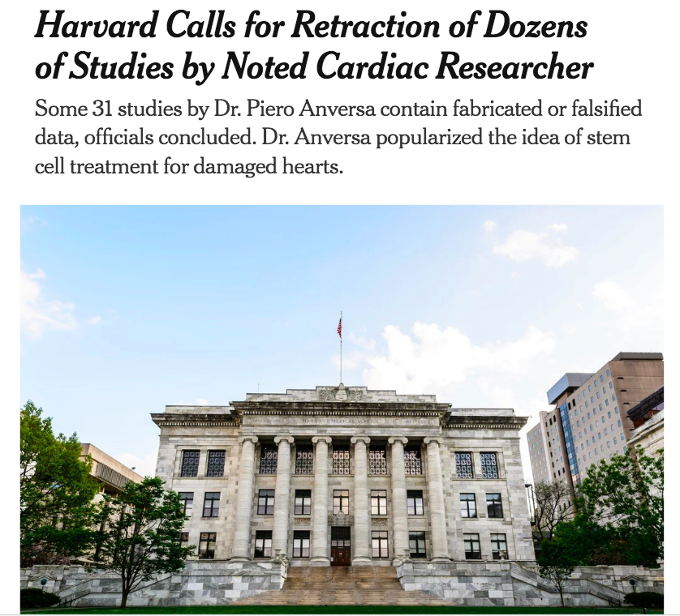{width=70%}

# What are the factors contributing to the crisis?

# Statistic's Contribution

*p* = 0.05 = 1/20

# Statistic's Contribution

**One in twenty**

# 

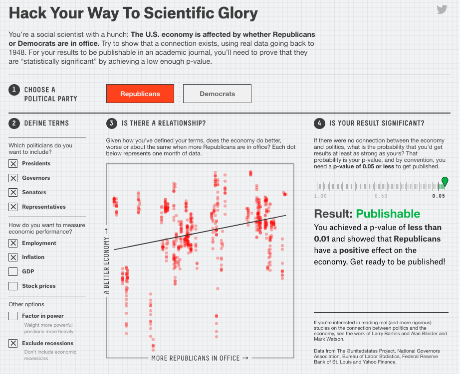{width=80%}

Aschwanden and King 2015 *fivethirtyeight.com/features/science-isnt-broken*

# 

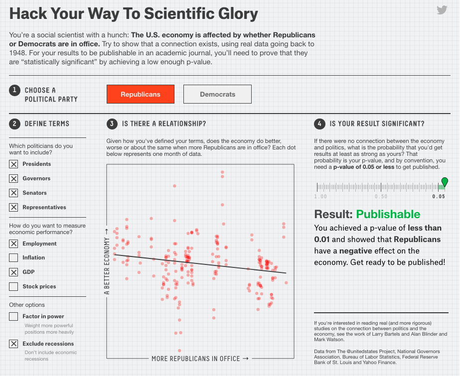{width=80%}

Aschwanden and King 2015 *fivethirtyeight.com/features/science-isnt-broken*

# 

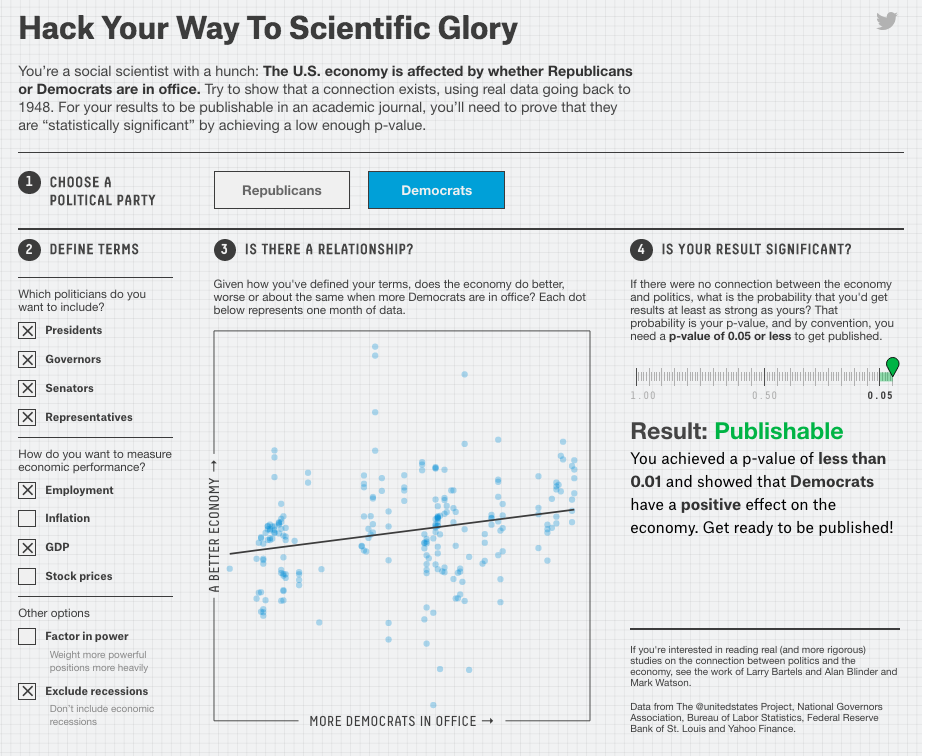{width=80%}

Aschwanden and King 2015 *fivethirtyeight.com/features/science-isnt-broken*

# 

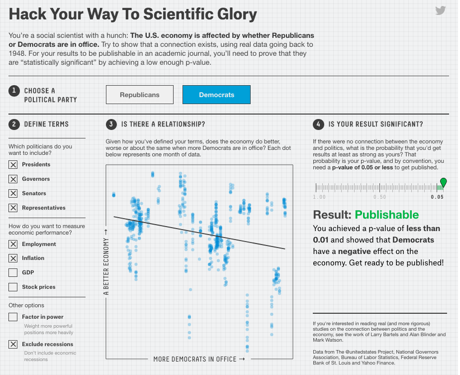{width=80%}

Aschwanden and King 2015 *fivethirtyeight.com/features/science-isnt-broken*

# 

{width=100%}

# What are the factors contributing to the crisis?

{width=70%}

# Computation is playing a significant role

{width=70%}

# Motivation: Journal Policy Impacts

{width=90%}

# Motivation: Journal Policy Impacts

{width=90%}

# Motivation: Journal Policy Impacts

{width=50%}

# Motivation: Ecology Journal Policies

{width=50%}

Meeslan, Heer and White 2016 *Trends in Eco Evo*

# Motivation: Social Science Journal Policies

{width=80%}

Crosas et al. 2018 *SocArXiv*

# Crisis and Opportunity

{width=80%}

# Crisis and Opportunity

The Chinese use two brush strokes to write the word 'crisis.' One
brush stroke stands for danger; the other for opportunity. In a
crisis, be aware of the danger--but recognize the opportunity.

-- John F. Kennedy

# Benefaction: the real benefit

$$ f(benefaction) = science $$

<!-- accessing your own projects -->
<!-- data synthesis -->
<!-- reviewing -->

# Opportunity: Benefaction not just reproducibility

**Repetition**
{width=80%}

*Colberg et al. 2015 Comm ACM*

# Opportunity: Benefaction not just reproducibility

**Reproduction**
{width=80%}

*Colberg et al. 2015 Comm ACM*

# Opportunity: Benefaction not just reproducibility

**Benefaction**
{width=80%}

*Colberg et al. 2015 Comm ACM*

# What can we do?

# What can we do?

{width=100%}

# Top Three List

1. Learn a programming language (statistical, command)

<!-- Speaking directly through the computer, not a mouse interpreter -->
<!-- Learning at least one language gives you access to many -->

# Top Three List

1. Learn a programming language (statistical, command)
2. Make your workflow transparent (data, code and notes)

<!-- Programming languages help, formal syntax and grammar -->
<!-- Minimize manual data processing -->
<!-- Clear path to data -->
<!-- Embedding notes and code and link to results (Rmarkdown) -->

# Top Three List

1. Learn a programming language (statistical, command)
2. Make your pipelines transparent (data, code and notes)
3. Share and take credit! 

<!-- Programming has produced many tools to track, attribute and share -->
<!-- Can automate many parts of workflows from data porcessing to publication -->

# Programming Languages

- *R*: free, open-source, designed for analysis
- *python*: also free and open-source, designed for more general
computation
- *BASH*: command language, glues software together

# Programming Languages

- *R*: free, open-source, designed for analysis
- *python*: also free and open-source, designed for more general
computation
- *BASH*: command language
- *Ruby*, *Java*, *C++*, *MatLab*, *Octave*, *Stata*, and many more.

# Transparency

- Consistent project architecture

# Transparency

- Project architecture
- Version control

# Transparency: Project Architecture

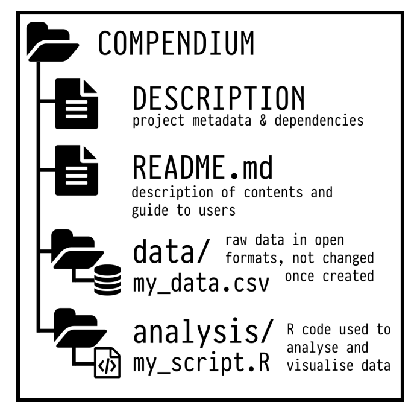{width=80%}

Marwick et al. 2015

<!-- **Relative Pathways** -->

# Transparency: Relative Pathways ("./")

{width=80%}

Marwick et al. 2015

# Transparency: Version Control

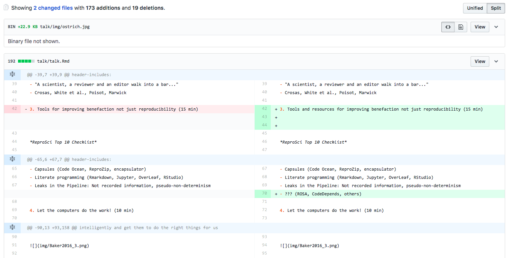

<!-- Originally created to help write Linux -->
<!-- Keeps a record of changes -->
<!-- Works with the any file, but made for code/text -->

# Transparency: Version Control

*www.github.com*

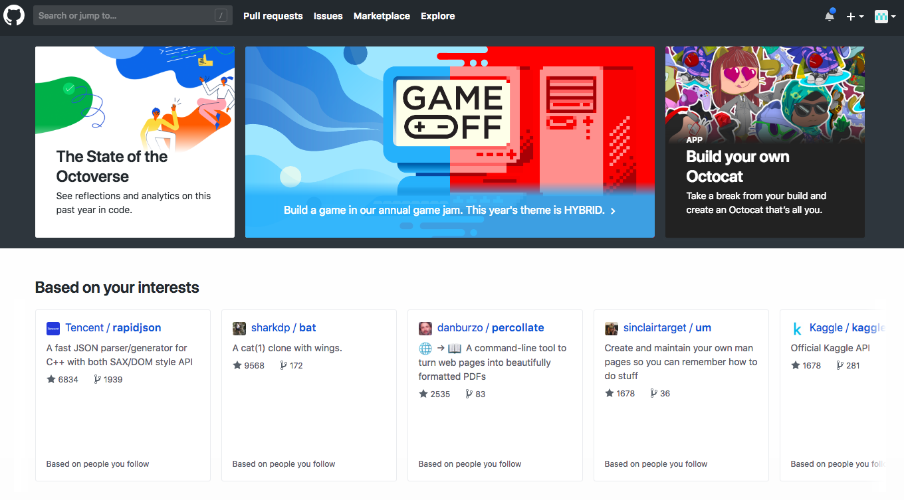

<!-- Collaborative coding -->
<!-- Provides a releasable, standardized record -->
<!-- database functionality -->

# Transparency: Version Control

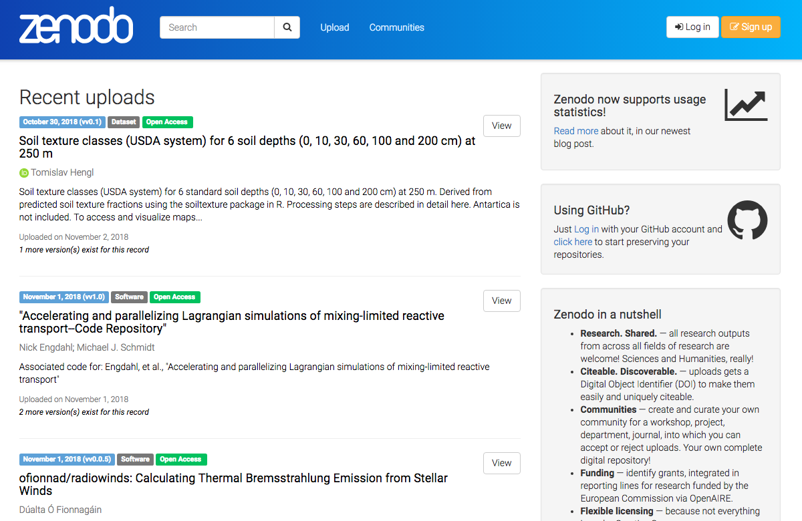

<!-- Licensing and attribution tools -->

# 

<!-- Reality -->
<!-- I'm an ecologist -->

# 

{width=100%}

# 

{width=100%}

<!-- Increasing importance of computation -->
<!-- Need for tools to aid reproducibility and benefaction -->
<!-- Similar challenges in Ecosystem Ecology and Particle Physics -->

#

*Most scientists don't want to write software, they want to do science.*

# Wild-wild West of Statistical Software

{width=60%}

<!-- However, after almost ten years of being an open-source advocate... -->
<!-- Ecologists aren't CS majors, they're tree climbing, scub-diving types -->

# R-ube Goldberg Coding

{width=95%}

<!-- Single-minded software, get the analysis done! -->

# Code Cleaning and Encapsulation

*Let's get the computer to work for us and decrease error rates and increase sharing.*

<!-- Projects that are pushing the envelope -->

# Code Cleaning and Encapsulation

# Code Cleaning and Encapsulation

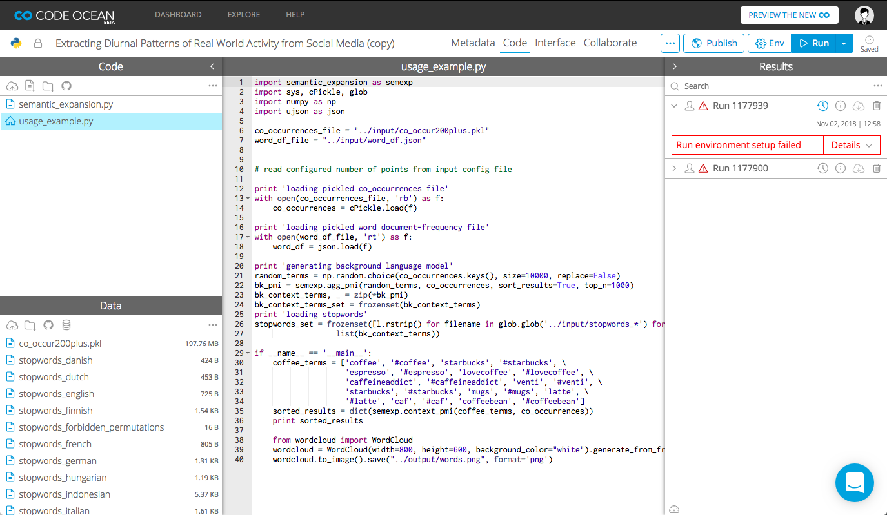

# Code Cleaning and Encapsulation

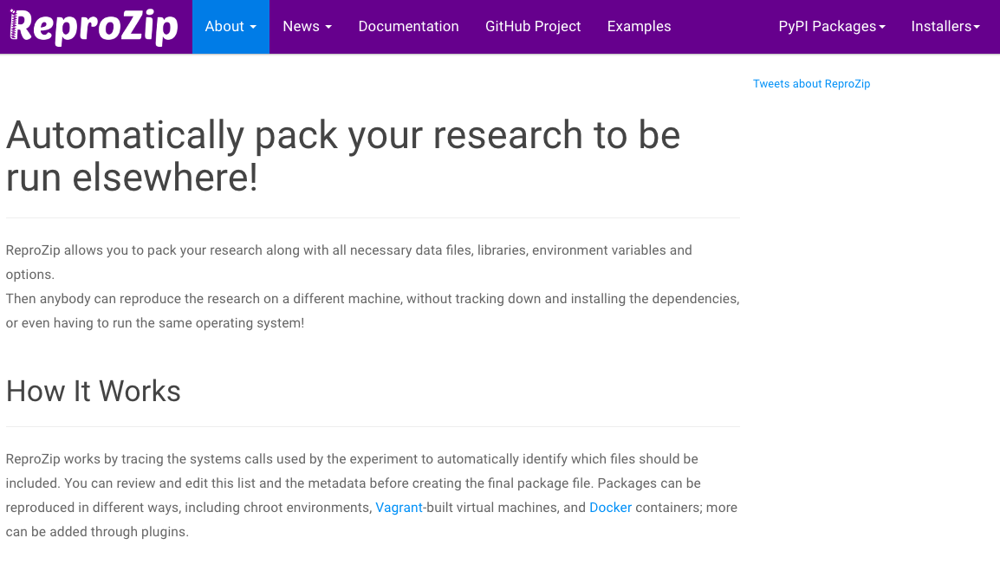

# Code Cleaning and Encapsulation

# Code Cleaning and Encapsulation

*RClean*: Simplify code based on specified results.

Lau 2018 *CRAN*

*Encapsulator*: generate a cleaned capsule.

Pasquier et al. 2017 *IEEE CISE*

- Capsule = all necessary software and data
- Cleaned = organize files, remove non-essential code and re-format

# Tools: Encapsulator

- near stream-of-consciousness coding that follows a train of thought in script development,
- output to console that is not written to disk,
- intermediate objects that are abandoned,
- library and new data calls throughout the script,
- output written to disk but not used in final documents,
- code that is not modularized,
- code that is syntactically correct but not particularly comprehensible.

# Encapsulation: Under-the-hood

{width=80%}

# Encapsulation: Under-the-hood

{width=50%}

# Encapsulation: Under-the-hood

{width=70%}

# Encapsulation: Under-the-hood

{width=70%}

# Tools: Encapsulator

Basic Usage (current paradigm):

1. Code as usual in your normal environment while recording provenance
2. Run encapsulator from the console
3. List desired results

# Tools: Encapsulator

Basic Usage (current paradigm):

1. Code as usual in your normal environment while recording provenance
2. Run encapsulator from the console
3. List desired results

**Product** = Capsule containing essential code and data organized
following project best practices inside a virtual machine

# 

**Software should not limit science**

# 

{width=100%}

# 

Computation will not replace good scientific thought or practice.

# 

Computation will not replace good scientific thought or practice.

But hopefully it can help.

# Thanks for listening!

- Databases: *Github Data*, *Data Dryad*, *Figshare*, *Dataverse*
- Open Source Communities: *ROpenSci*, *RStudio*, *Center for Open
  Science*, *Transparency in Ecology and Evolution Website and Blog*
- Tools: *Reprozip*, *CodeOcean*, *encapsulator*, *Rclean*

*Contact*: _matthewklau@fas.harvard.edu_ + **Github = MKLau** + https://mklau.info

*Much of this work was supported by NSF SSI-1450277 (End-to-End Provenance) and ACI-1448123 (Citation++).*
*More details are available at https://projects.iq.harvard.edu/provenance-at-harvard*

{width=19%}
{width=20%}
{width=25%}
{width=15%}

