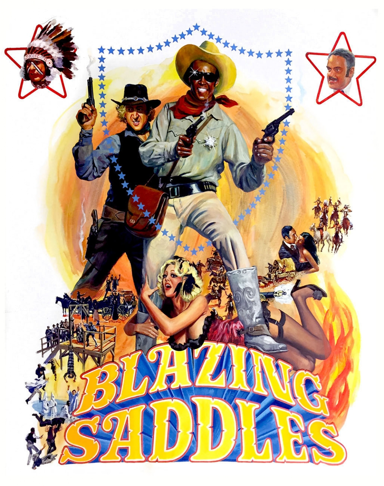
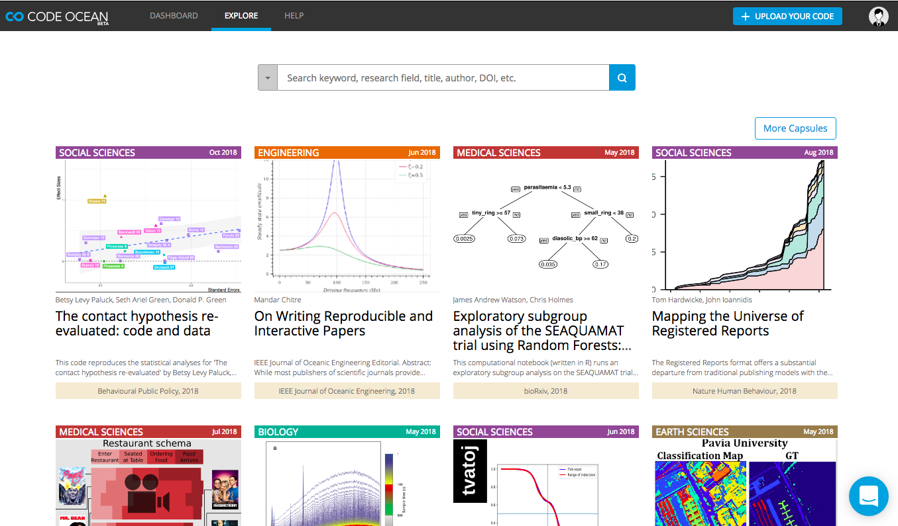

<!-- 29October2018 -->


<!-- output: powerpoint_presentation -->
<!-- ```{r setup, include=FALSE} -->
<!-- knitr::opts_chunk$set(echo = FALSE) -->
<!-- ``` -->

<!-- # Overview: -->

<!-- - There are major issues in reproducibility repeatibility in science -->
<!-- - Computation is playing a major role -->
<!-- - Talk about the issues and how they point to opportunities and tools -->
<!--   to making it easier to do science better -->


<!-- 1. Crisis (Baker, big picture, computational focus) (10 min) -->

<!-- - Baker 2015 -->
<!-- - Sources of irreproducibility -->
<!-- - Focus on computation -->
<!-- - Just providing data is not enough (Stodden 2018) -->
<!-- - Journal policies are shifiting, motivated to make the review process -->
<!-- easier (Data-PASS) -->
<!-- - Crosas, White et al. -->
<!-- - Statistical motiviation: Being wrong for the right reasons p = 0.05 -->
<!-- - Crisis and opportunity (Kennedy) -->


<!-- 2. Opportunities (10 min) -->


<!-- - Benefaction, not just reproducibility -->
<!-- - Shifting practices will make it easier to share and access -->
<!--   science (Benefaction and Synthesis) -->

<!-- - BREAK What can we do? (Ostrich) -->

<!-- - Computation is a significant limitation -->
<!-- - Sources of computational irreproducibility -->
<!-- - Poisot, Marwick -->
<!-- - *Tales of Analytical Terror* (Sharing code via email, versioning via -->
<!--   filenames, Absolute paths) -->
<!-- - Pasquier, Lau, Trisovic et al. 2017 -->
<!-- - R Rube Goldberg and The Wild Wild West of Code -->
<!-- - Analyses should not be a black box -->
<!-- - Every script is a perfectly unique snowflake that should be reproducibile -->


<!-- 3. Tools and resources for improving benefaction not just reproducibility (10 min) -->

<!-- - BREAK There and back again: A scientists tale -->


<!-- *Top Three List*  -->

<!-- 1. Learn a programming language  -->
<!-- - Lost in Translation: Not programming is like speaking through an interpreter -->
<!-- - Most popular programming languages -->
<!-- - Create a replicable, transparent document of data processing and -->
<!-- analyses -->
<!-- - Create and access new analytical methods faster -->
<!-- - End Mouse Finger now!  -->
<!-- 2. Apply a standard project structure and best practices -->
<!-- - Share more easily -->
<!-- - More robust projects -->
<!-- - You'll thank yourself later -->
<!-- 3. Use a version control system -->
<!-- - Create a fully documented record of all changes (code and data) -->
<!-- - Easily links to internet based communities -->

<!-- *Making Code More Robust and Transparent* -->

<!-- 1. Database your data and Meta-data (open-data) -->
<!-- 2. Provide your code with LICENSE (open-source) -->
<!-- 3. Use project organization best practices (Marwick) -->
<!-- 4. Check your style (formatR) -->
<!-- 5. System information (capsules, Docker) -->
<!-- 6. Dependency information (package manager) -->
<!-- 7. Create checks (testthat, testdata) -->
<!-- 8. Version control (git, subversion, github) -->
<!-- 9. Continuous integration (Travis, CircleCI) -->
<!-- 10. Create a make file  -->

<!-- - From wet to dry to digital (notes and digitizing records) -->
<!-- - Version Control for data and code (Git, Github, RStudio) -->
<!-- - Dependencies (packrat, RStudio package manager) -->
<!-- - Testing and checks (testthat, testdata) -->
<!-- - Data provenance (RDT, provR, recordR) -->
<!-- - Tools for linking Databases (figshare, dryad, pangea, Dataverse) -->
<!-- - Pipeline management (VisTrails, Refinery, Kepler) -->
<!-- - Environment  -->
<!-- - Capsules (Code Ocean, ReproZip, encapsulator) -->
<!-- - Literate programming (Rmarkdown, Jupyter, OverLeaf, RStudio) -->
<!-- - Leaks in the Pipeline: Not recorded information, pseudo-non-determinism -->
<!-- - ??? (ROSA, CodeDepends, others) -->


<!-- 4. The Future (10 min) -->

<!-- Easier Pipelines -->


<!-- - Workflow Pipeline from Thoughts to Data  to Code to Papers and Back Again -->
<!-- - Encapsulation -> Code Ocean -> Github -> CircleCI -> Journals -->

<!-- - Capsules -->
<!-- - Dataverse and Code Ocean -->
<!-- - ReproZip -->
<!-- - Code Cleaning (RClean) -->
<!-- - encapsulation -->
<!-- - data provenance (formalized) -->


<!-- 5. Take-home, Future Directions and Thanks (5 min) -->

<!-- - Software should not limit science, it should enable it. -->
<!-- - Computation will not replace good scientific thought or practice -->
<!-- - In taking advantage of new tools, we gain a lot if we use them -->
<!-- intelligently and get them to do the right things for us -->

<!-- - Reproducibility Resources -->


<!-- - Acknowledgements -->


########################################################################################
########################################################################################
#############################   START   ################################################
########################################################################################
########################################################################################

# 

{width=70%}

# 

{width=70%}


# So, how bad is it, really?


{width=70%}


# What are the factors contributing to the crisis?


# Statistic's Contribution

*p* = 0.05 = 1/20

# Statistic's Contribution

**One in twenty**


# 

{width=80%}

Aschwanden and King 2015 *fivethirtyeight.com/features/science-isnt-broken*

# 

{width=80%}

Aschwanden and King 2015 *fivethirtyeight.com/features/science-isnt-broken*

# 

{width=80%}

Aschwanden and King 2015 *fivethirtyeight.com/features/science-isnt-broken*

# 

{width=80%}

Aschwanden and King 2015 *fivethirtyeight.com/features/science-isnt-broken*

# 


$$ Please vote! $$


# What are the factors contributing to the crisis?

{width=70%}

# Computation is playing a significant role

{width=70%}


# Computation is playing a significant role

{width=70%}

# Motivation: Journal Policy Impacts

{width=70%}


# Motivation: Journal Policy Impacts

{width=60%}


# Motivation: Ecology Journal Policies

{width=50%}

Meeslan, Heer and White 2016 *Trends in Eco Evo*


# Motivation: Social Science Journal Policies

{width=80%}

Crosas et al. 2018 *SocArXiv*


# Crisis and Opportunity

The Chinese use two brush strokes to write the word 'crisis.' One
brush stroke stands for danger; the other for opportunity. In a
crisis, be aware of the danger--but recognize the opportunity.

-- John F. Kennedy


# Benefaction: the real benefit

$$ f(benefaction) = science $$

<!-- accessing your own projects -->
<!-- data synthesis -->
<!-- reviewing -->

# Opportunity: Benefaction not just reproducibility

**Repetition**
{width=80%}

*Colberg et al. 2015 Comm ACM*

# Opportunity: Benefaction not just reproducibility

**Reproduction**
{width=80%}

*Colberg et al. 2015 Comm ACM*

# Opportunity: Benefaction not just reproducibility

**Benefaction**
{width=80%}

*Colberg et al. 2015 Comm ACM*


# What can we do?

{width=100%}


# Top Three List

1. Learn a programming language (statistical, command)

<!-- Speaking directly through the computer, not a mouse interpreter -->
<!-- Learning at least one language gives you access to many -->

# Top Three List

1. Learn a programming language (statistical, command)
2. Make your workflow transparent (data, code and notes)

<!-- Programming languages help, formal syntax and grammar -->
<!-- Minimize manual data processing -->
<!-- Clear path to data -->
<!-- Embedding notes and code and link to results (Rmarkdown) -->

# Top Three List

1. Learn a programming language (statistical, command)
2. Make your pipelines transparent (data, code and notes)
3. Share and take credit! 

<!-- Programming has produced many tools to track, attribute and share -->
<!-- Can automate many parts of workflows from data porcessing to publication -->

# Programming Languages

- *R*: free, open-source, designed for analysis
- *python*: also free and open-source, designed for more general
computation
- *BASH*: command language, glues software together

# Programming Languages

- *R*: free, open-source, designed for analysis
- *python*: also free and open-source, designed for more general
computation
- *BASH*: command language
- *Ruby*, *Java*, *C++*, *MatLab*, *Octave*, *Stata*, and many more.


# Transparency

- Consistent project architecture


# Transparency

- Project architecture
- Version control


# Transparency: Project Architecture

{width=90%}

Marwick et al. 2015


# Transparency: Project Architecture

{width=90%}

Marwick et al. *In Press*

**Relative Pathways**

*./*


# Transparency: Version Control


<!-- Originally created to help write Linux -->
<!-- Keeps a record of changes -->
<!-- Works with the any file, but made for code/text -->


# Transparency: Version Control

*www.github.com*


<!-- Collaborative coding -->
<!-- Provides a releasable, standardized record -->
<!-- database functionality -->

# Transparency: Version Control


<!-- Licensing and attribution tools -->


# Reality


<!-- I'm an ecologist -->

# Reality

{width=100%}

# Reality: Common Ground

{width=100%}

<!-- Increasing importance of computation -->
<!-- Need for tools to aid reproducibility and benefaction -->
<!-- Similar challenges in Ecosystem Ecology and Particle Physics -->

# Reality

*Most scientists don't want to produce software, they want to do
science.*

# Wild-wild West of Statistical Software

{width=80%}

<!-- However, after almost ten years of being an open-source advocate... -->
<!-- Ecologists aren't CS majors, they're tree climbing, scub-diving types -->

# R-ube Goldberg Coding

{width=80%}

<!-- Single-minded software, get the analysis done! -->


# Code Cleaning and Encapsulation

*Let's get the computer to work for us and decrease error rates and increase sharing.*

<!-- Projects that are pushing the envelope -->


# Code Cleaning and Encapsulation



# Code Cleaning and Encapsulation


# Code Cleaning and Encapsulation


# Code Cleaning and Encapsulation


# Code Cleaning and Encapsulation

*RClean*: Simplify code based on specified results.

Lau 2018 *CRAN*

*Encapsulator*: generate a cleaned capsule.

Pasquier et al. 2017 *IEEE CISE*

- Capsule = all necessary software and data
- Cleaned = organize files, remove non-essential code and re-format


# Tools: Encapsulator

- near stream-of-consciousness coding that follows a train of thought in script development,
- output to console that is not written to disk,
- intermediate objects that are abandoned,
- library and new data calls throughout the script,
- output written to disk but not used in final documents,
- code that is not modularized,
- code that is syntactically correct but not particularly comprehensible.


# Encapsulation: Under-the-hood

{width=80%}

# Rclean and Encapsulator

{width=50%}


# Encapsulation: Under-the-hood

{width=70%}

# Encapsulation: Under-the-hood

Example: Messycode

{width=70%}


# Tools: Encapsulator

Basic Usage (current paradigm):

1. Code as usual in your normal environment while recording provenance
2. Run encapsulator from the console
3. List desired results

# Tools: Encapsulator

Basic Usage (current paradigm):

1. Code as usual in your normal environment while recording provenance
2. Run encapsulator from the console
3. List desired results

**Product** = Capsule containing essential code and data organized
following project best practices inside a virtual machine

# 

** Software should not limit science **

# 


# 

Computation will not replace good scientific thought or practice.

# 

Computation will not replace good scientific thought or practice.

But hopefully it can help.

# Thanks for listening!

*Resources:*

- Databases: *Github Data*, *Data Dryad*, *Figshare*, *Dataverse*
- Open Source Communities: *ROpenSci*, *RStudio*, *Center for Open
  Science*, *Transparency in Ecology and Evolution*
- Tools: *Reprozip*, *CodeOcean*, *Rclean*

*Contact Info:*

- **Email: _matthewklau@fas.harvard.edu_**
- **Github: MKLau**

*Much of this work was supported by NSF SSI-1450277 (End-to-End Provenance) and ACI-1448123 (Citation++).*
*More details are available at https://projects.iq.harvard.edu/provenance-at-harvard*

{width=19%}
{width=20%}
{width=25%}
{width=15%}

