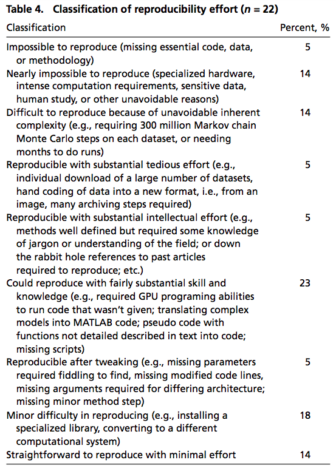
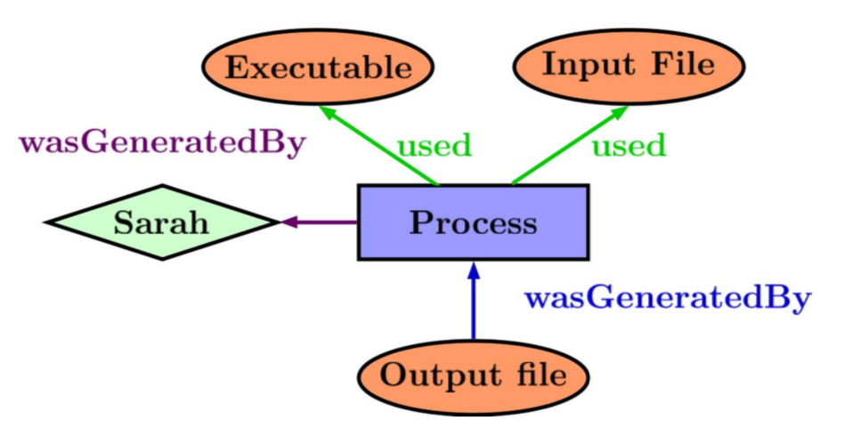

<!-- 29October2018 -->


<!-- output: powerpoint_presentation -->
<!-- ```{r setup, include=FALSE} -->
<!-- knitr::opts_chunk$set(echo = FALSE) -->
<!-- ``` -->

# Overview:

1. Crisis (Baker, big picture, computational focus) (10 min)

- Baker 2015
- Sources of irreproducibility
- Focus on computation
- Just providing data is not enough (Stodden 2018)
- Journal policies are shifiting, motivated to make the review process
easier (Data-PASS)
- Crosas, White et al.
- Statistical motiviation: Being wrong for the right reasons p = 0.05
- Crisis and opportunity (Kennedy)


2. Opportunities (10 min)


- Benefaction, not just reproducibility
- Shifting practices will make it easier to share and access
  science (Benefaction and Synthesis)

- BREAK What can we do? (Ostrich)

- Computation is a significant limitation
- Sources of computational irreproducibility
- Poisot, Marwick
- *Tales of Analytical Terror* (Sharing code via email, versioning via
  filenames, Absolute paths)
- Pasquier, Lau, Trisovic et al. 2017
- R Rube Goldberg and The Wild Wild West of Code
- Analyses should not be a black box
- Every script is a perfectly unique snowflake that should be reproducibile


3. Tools and resources for improving benefaction not just reproducibility (10 min)

- BREAK There and back again: A scientists tale


*Top Three List* 

1. Learn a programming language 
- Lost in Translation: Not programming is like speaking through an interpreter
- Most popular programming languages
- Create a replicable, transparent document of data processing and
analyses
- Create and access new analytical methods faster
- End Mouse Finger now! 
2. Apply a standard project structure and best practices
- Share more easily
- More robust projects
- You'll thank yourself later
3. Use a version control system
- Create a fully documented record of all changes (code and data)
- Easily links to internet based communities

*Making Code More Robust and Transparent*

1. Database your data and Meta-data (open-data)
2. Provide your code with LICENSE (open-source)
3. Use project organization best practices (Marwick)
4. Check your style (formatR)
5. System information (capsules, Docker)
6. Dependency information (package manager)
7. Create checks (testthat, testdata)
8. Version control (git, subversion, github)
9. Continuous integration (Travis, CircleCI)
10. Create a make file 

- From wet to dry to digital (notes and digitizing records)
- Version Control for data and code (Git, Github, RStudio)
- Dependencies (packrat, RStudio package manager)
- Testing and checks (testthat, testdata)
- Data provenance (RDT, provR, recordR)
- Tools for linking Databases (figshare, dryad, pangea, Dataverse)
- Pipeline management (VisTrails, Refinery, Kepler)
- Environment 
- Capsules (Code Ocean, ReproZip, encapsulator)
- Literate programming (Rmarkdown, Jupyter, OverLeaf, RStudio)
- Leaks in the Pipeline: Not recorded information, pseudo-non-determinism
- ??? (ROSA, CodeDepends, others)


4. The Future (10 min)

Easier Pipelines


- Workflow Pipeline from Thoughts to Data  to Code to Papers and Back Again
- Encapsulation -> Code Ocean -> Github -> CircleCI -> Journals

- Capsules
- Dataverse and Code Ocean
- ReproZip
- Code Cleaning (RClean)
- encapsulation
- data provenance (formalized)


5. Take-home, Future Directions and Thanks (5 min)

- Software should not limit science, it should enable it.
- Computation will not replace good scientific thought or practice
- In taking advantage of new tools, we gain a lot if we use them
intelligently and get them to do the right things for us

- Reproducibility Resources


- Acknowledgements

# 


# 


# 


# So, how bad is it, really?

# 

We got one big thing wrong (dietetics) – In the 1950s there was an
alarming increase in the rates of coronary heart disease in America. A
prominent scientist argued that this was due to the increase of fats
in our diet. This view won out. By the 1980s nobody would have come up
with any other explanation. The US government, in their dietary
guidelines painted fat as unhealthy and produced guidelines that would
limit its intake. The American Heart Association agreed. Thus probably
billions of research dollars were channeled into researching this. In
the 1960s a number of researchers also suggested that
carbohydrates/sugars were the cause, but they lost. And only in the
last decade has this become an acceptable hypothesis again and it
seems increasingly clear that the increase in carbohydrates in our
diet (a trend present in the 1950s but actually accelerated by the
avoidance of fats) is also highly problematic. At least as problematic
as fat. Evidence on the relative balance is not yet clear, but it is
at least credible that sugar is much worse for us than fat. The
definition of an acceptable research agenda, research dollars, and
public policy were all off target for half a century. Oops.


# Computation is playing a significant role


# Crisis and Opportunity

The Chinese use two brush strokes to write the word 'crisis.' One
brush stroke stands for danger; the other for opportunity. In a
crisis, be aware of the danger--but recognize the opportunity.

-- John F. Kennedy


# 

- There are major issues in reproducibility repeatibility in science
- Computation is playing a major role
- Talk about the issues and how they point to opportunities and tools
  to making it easier to do science better, easier

# What can we do?


# What can we do? 

- Open-process
- Open-data
- Open-software

# Benefaction: the real benefit

# Opportunity: Benefaction not just reproducibility

{width=70%}

*Colberg et al. 2015 Comm ACM*

# Opportunity: Benefaction not just reproducibility

{width=70%}

*Colberg et al. 2015 Comm ACM*

# Opportunity: Benefaction not just reproducibility

{width=70%}

*Colberg et al. 2015 Comm ACM*


# 


<!-- I'm an ecologist -->


# Motivation: Code in Ecology

{width=70%}

# Motivation: Ecology Journal Policies

{width=50%}

*Meeslan, Heer and White 2016 Trends in Eco Evo*

# Motivation: Social Science Journal Policies

{width=70%}

*Crosas et al. 2018 SocArXiv*

# Motivation: Journal Policy Impacts

{width=70%}


# Motivation: Journal Policy Impacts

{width=70%}

# Motivation: Journal Policy Impacts

{width=70%}

*Stodden et al. 2018 PNAS*

# Goal: Repeatability/Reproducibility

metadata + data + code + results + contact

# Goal: Repeatability/Reproducibility

BestPractices(metadata + data + code + results + contact)

# Goal: Repeatability/Reproducibility

BestPractices(metadata * data * code * results * contact)

# Opportunity: Benefaction not just reproducibility

$$ Synthesis = f(benefaction) $$


# Research Pipeline

| Thought      | Data Collection            | Data Processing               | Analysis                          | Reporting                  |
| :---------   | :------------------------- | :---------------------------- | :-------------------------------- | :------------------------- |
| *Meta-Data*  | *Meta-Data* + *Provenance* | *Provenance* + *Versioning*   | *Versioning* + *Provenance*       | *Lit Prog* + *Versioning*  |

# Reproduciblity Top Three List

1. Don't process your data manually 
2. Make your pipelines transparent (data, code and notes)
3. Take credit! 

# Analytical Code Top Three List

1. Follow software best practices
2. Follow a consistent project architecture
3. Use version control for code and data

# Resources:

- Databases List
- Tools List
- Reproducibility blogs
- RStudio
- ROpenSci
- Open Science Foundation
- Transparency in Ecology and Evolution Website and Blog
- BioRxiv


# Reality: Common Ground

{width=70%}

# Reality: Common Ground

{width=70%}

<!-- Similar challenges in Ecosystem Ecology and Particle Physics -->

# Reality: Common Ground

- *Most scientists don't want to produce software, they want to do
science.*


# Reality: Common Ground

- *Most scientists don't want to produce software, they want to do
science.*

- *Let's automate as much of the process as we can to lower activation
energy, decrease error rates and increase sharing.*


# Tools: Encapsulator


# Tools: Encapsulator

Goal: Simplify computational reproducibility

1. Create a data "capsule" with code, data and environment

# Tools: Encapsulator

Goal: Simplify computational reproducibility

1. Create a data "capsule" with code, data and environment
2. Increase transparency with "cleaned" code and workspace


# Tools: Encapsulator

Goal: Simplify computational reproducibility

1. Capsule = all necessary software and data
2. Cleaned = organize files, remove non-essential code and re-format

# Tools: Encapsulator

Basic Usage (current paradigm):

1. Code as usual in your normal environment while recording provenance
2. Run encapsulator from the console
3. List desired results
4. Product = Capsule containing essential code and data with a virtual machine

# What is data provenance?

{width=80%}


# Tools: Encapsulator

Example: Messycode

{width=70%}

# Tools: Encapsulator

Example: Messycode

- near stream-of-consciousness coding that follows a train of thought in script development,
- output to console that is not written to disk,
- intermediate objects that are abandoned,
- library and new data calls throughout the script,
- output written to disk but not used in final documents,
- code that is not modularized,
- code that is syntactically correct but not particularly comprehensible.

# Tools: Encapsulator

Example: Messycode

{width=70%}

# Tools: Encapsulator

Example: Messycode

{width=70%}

# Tools: Encapsulator

Requirements: Simplify computational reproducibility

1. The environment should present a user interface familiar to
   scientists.
2. Encapsulation and use (de-encapsulation) of time capsules must
require minimal technical expertise.
3. The installation process itself must also require minimum
intervention and technical knowledge.
4. Time capsules, their installation, and re-execution must be
   platform-independent.


# encapsulator(A Kit of Parts): Capsule creation

- Virtual Machine (encapsulator)
- Docker (containR)
- Literate computing notebook (Jupyter)
- Compressed (Reprozip)
- Capsule database (Code Ocean)


# What is data provenance?

{width=80%}


# What is data provenance?

{width=50%}

# Data Provenance and R


<!-- However, after almost ten years of being an open-source advocate... -->
<!-- Ecologists aren't CS majors, they're tree climbing, scub-diving types -->

# Data Provenance and R


<!-- Single-minded software, get the analysis done! -->

# Data Provenance and R

{width=70%}

# encapsulator(A Kit of Parts): Provenance Details

- inputs
- outputs
- transient data objects and their values
- operations
- library dependencies


# Encapsulator and benefaction

1. Eases and (potentially) improves project archiving
2. Increases clarity for re-use (others and self)

# Conclusion: The next great challenge is synthesis

<!-- Benefaction not irreproducibility! -->

** Software should not limit science **

# Conclusion: The next great challenge is synthesis

{width=20%}


# Questions and Discussion:

*Possible discussion topics:*

{width=20%}

1. What checks are in place to verify and link dataverses?
2. Can provenance production become a part of the checking system?
3. What are the pros and cons of automated checking/verification
   and/or cleaning/encapsulation of dataverses?
4. I'm focused on R's wild-wild-west, but how does this translate to
   other languages?

*Contact Info:*

**Email: _matthewklau@fas.harvard.edu_**

**Github: MKLau**

**Slack: MKLau**

*Much of this work was supported by NSF SSI-1450277 (End-to-End Provenance) and ACI-1448123 (Citation++).*
*More details are available at https://projects.iq.harvard.edu/provenance-at-harvard*

{width=19%}
{width=20%}
{width=25%}
{width=15%}


# Tools: Overview

|                 | Dataverse  | Code Ocean  |  Zenodo   | Figshare  | Dryad    | PANGAEA | GitHub & Bitbucket | Supplementary Material |
| :-------------- | :----:     | :----:      | :----:    | :-------: | :---:    | :-----: | :----------------: | :--------------------: |
| Meta Data       | Yes        | Yes         |  Yes      | Yes       | Yes      | Yes     | Yes                | Yes                    |
| Data Hosting    | Yes        | Yes         |  Yes      | Yes       | Yes      | Yes     | Yes                | Yes                    |
| Code Hosting    | Yes        | Yes         |  Yes      | No        | No       | No      | Yes                | Yes                    |
| Versioning      | No?        | No?         |  Yes      | No        | No       | No      | Yes                | No                     |
| Capsules        | No         | Yes         |  No       | No        | No       | No      | No                 | No                     |
| Assigns DOI     | Yes        | Yes         |  Yes      | Yes       | Yes      | Yes     | No                 | No                     |
| License         | Flexible   | Flexible    | Flexible  | MIT       | CC0      | CC-BY   | Flexible           | None                   |
| Cost            | None       | Possible    |  None     | None      | Possible | None    | None               | None                   |

*Adapted from Mislan, Heer & White 2016 Trends in Ecol Evol*


<!-- # encapsulator(A Kit of Parts): Checking inputs and outputs -->

<!-- - *lintR* (Hester 2017) -->
<!-- - *containR* (Chen 2018) -->

<!-- # encapsulator(A Kit of Parts): Code Formatting -->

<!-- - *formatR* (Xie 2017)  -->
<!-- - *styler* (Muller & Walther 2018) -->

<!-- # encapsulator(A Kit of Parts): Code Cleaning  -->

<!-- - *Rclean* (Lau 2018)  -->
<!-- - *CodeDepends* (Lang et al. 2018) -->
